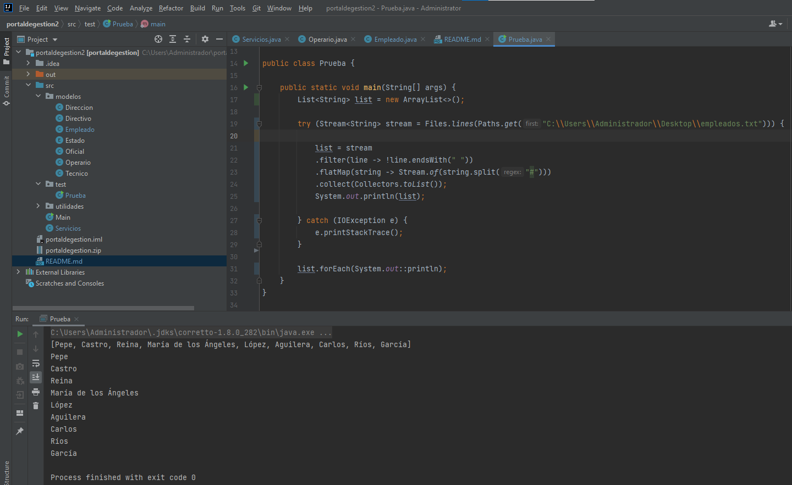
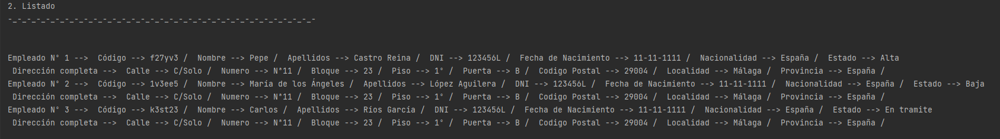
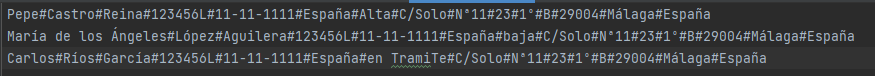
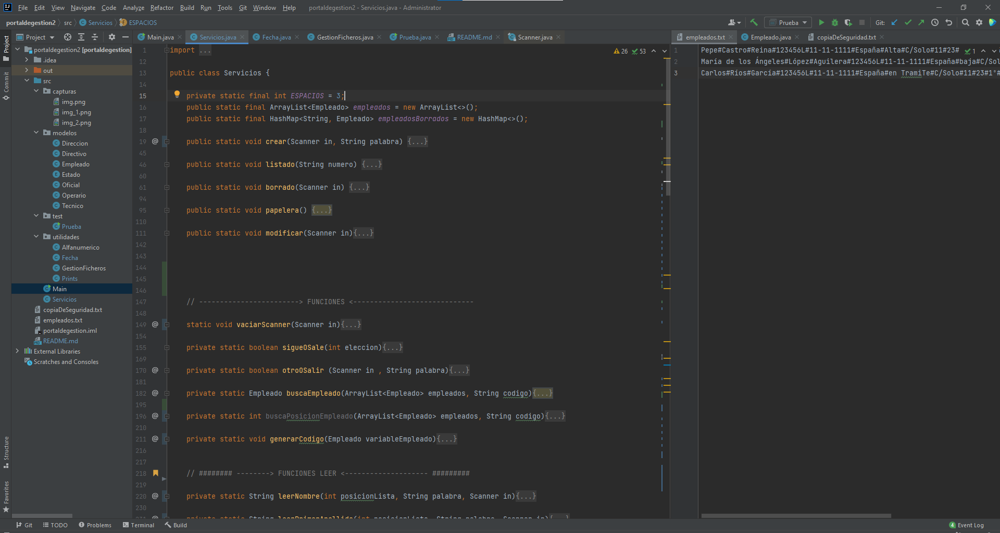
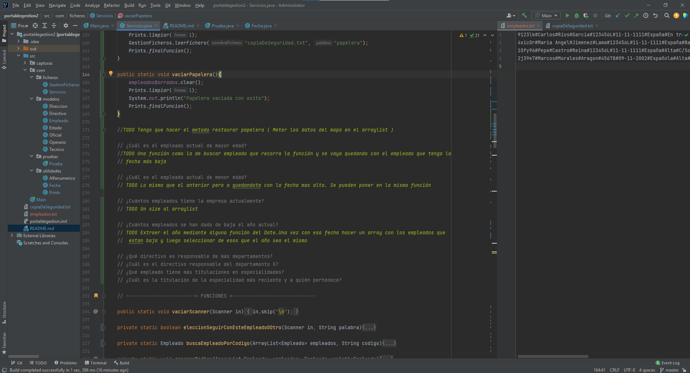

# Portal de gestión

## → Proyecto en Dekra ← 

Usaré este readme a modo de bloc de notas para apuntar las dudas o cuestiones y irlas pasando de ordenador a ordenador 
sin problemas. Tambien llevare un diario sobre las cosas que realizo. A partir del 20/04/2020 añadire horas de entrada 
al diario para hacer más preciso y estimado las horas a las que encuentro los fallos y cuanto tardo en la solución de 
los mismos.

`Cuestiones a resolver :`

¿Esta bien como he utilizado los enum?   <--
¿Esta bien mi salida formateadad de datos para reformar los datos de alta?  
¿Puedo cambiar o mejorar la manera en la que utilizo el enum para optimizar el proceso?  

¿He aplicado bien el principio divide y venceras?  
Separar las funciones de la clase Servicio o dejarlo dentro

---
- Como hacer para que reescriba el archivo de los empleados
- Que es mas correcto o efectivo : ¿listar desde el array o del fichero?
- Me gustaria revisar mis funciones leer
   

`Explicacion de funcionamiento de los archivos :`

###Este aparto es importante

Es importante que se sigan estos parametros sino te dara error al cargar tu archivo, el programa esta preparado para aunque
de fallo al cargar el archivo puedas trabajar en el pero es recomendable que trabajes con el archivo bien cargado para poder usar todas
las funciones de la aplicacion

- El archivo donde se guardaran a los empleados se debe llamar empleados.txt.
- El archivo donde se guardaran los datos de los empleados eliminados se debe llamar copiaDeSeguridad.txt.
- En caso de querer introducirlos escribiendo en el fichero deberás seguir el siguiente formato

Todos estos datos los separaremos con #

| Código | Nombre | Primer Apellido | Segundo Apellido | DNI | Fecha nacimiento | Nacionalidad | Estado | Calle | Numero | Bloque | Piso | Puerta | Codigo postal | Localidad | Provincia | Fecha Creacion | Fecha Borrado |
| :---:  | :---:  |     :---:       |      :---:       |:---:|       :---:      |    :---:     |  :---: | :---: | :---:  | :---:  |:---: |  :---: |      :---:    |   :---:   |   :---:   |     :---:      |     :---:     |
| Admite NULL |   |                 |                  |     |                  |              |        |       |        |        |      |        |               |           |           | Puede ser NULL (se le asignara la fecha del momento del ordenador) | Debe ser NULL (Se le asigna una al mandarlo a la papelera) |

`Registro diario :`

<b>_→ 19/04/2021 :_ </b>Primer día en la empresa, por ahora casi toda la mañana se ha basado en pasarme los archivos desde un 
 terminal ( el mio personal ) al ordenador proporcionado por la empresa. No estaba ninguno de mis responsables asi que
 no he visto las instalaciones ni nada de eso. Por ahora el proyecto.  

 Sergio ha encontrado un fallo en mi codigo ( cambio de dirección) y lo hemos corregido entre los dos, el fallo venia de
 no haber adaptado la función a cambiar ( la funcion cambio era una copia de la funcion creación ).  

 <b> Ya funciona la enumeración </b>, ahora solo me falta saber como cambiar el formato en el que sale 
 ( por ahora sale como es definido en el Enum ).  
 <b> He cambiado eso </b> y ahora da el dato con el formato deseado.  
 <b> He encontrado la forma de eliminar y mejorar el sistema que utilizaba para la reforma de datos </b> tras leer algunas
 documentaciones online y con ayuda de Sergio he encontrado una forma más optima de realizar el formateo de datos. He
 ayudado tambien a Sergio con el uso del enum ya que los dos estabamos dandole vueltas al tema de como usarlo   
 Hoy el proyecto ha terminado en la version 2.1 ( aunque por error en un commit la he nombrado V3).

<b>_→ 20/04/2021 :_</b> Vamos a tener ahora una reunion con curro para exponer las dudas y trabajarlas ( 8:38 )  
Hemos restrasado la reunión a las 10 por algunos imprevisto de ultima hora y hemos empezado a mirarnos excepciones ( 8:52 )  
Voy a probrar el try catch en la creacion de fechas ( 9:20 )  
Ya he implementado estas mejoras y he podido quitar el throw parse exception que tenia en todas las funciones que hacian referencia
a algun campo del tipo fecha en breves empezamos la reunión( 9:49 )  
La reunion termino sobre las 11 y sergio y yo aprovechamos para ir al descanso. Hemos vuelto hace un rato y estoy trabajando
en mejorar como se borran y cambian los datos de los empleados de manera efectiva (12:27)  
Por ahora todos los prints estan adeacuados a como yo queria tenerlos para hoy y ya he averiguado y aplicado una forma más
eficiente y concisa de establecer el estado de un empleado. He empezado a intentar ahora mejorar el modificar ( 13:09 )  
Casi ya no queda tiempo he dejado planteado algunos TODO para no perder el hilo de lo que tengo que hacer ( 14:47 )  

<b>_→ 21/04/2021 :_</b> Esta mañana hemos tenido hasta las 9:30 una pequeña clase con curro que nos ha explicado Arraylist
, List, Maps y Set. Y ahora acabo de terminar de reformar la función de borrado ( 10:36 )  
Casi he terminado la funcion de modificado, ya solo me falta guardar los nuevos valores en el arraylist (11:15)  
Ya he terminado los cambios a la funcion modificar y voy a empezar la papelera de los datos que creamos, la cual funciona 
con Maps( 13:27 )  
Ya he terminado con la papelera de HashMaps, voy a hacer un poco de limpieza de codigo, comentar y reestructurar estos ultimos
30 min ( 14:30 )

<b>_→ 22/04/2021 :_</b> Estoy haciendo algunos cambios en la funcion de modificar y borrar para que sean mas efectivas y
aparte estoy parchenado errores que se producen en ciertas ocasiones ( 9:35 ) 
Llevo toda la mañana con los ficheros y no estoy siendo capaz de conseguir que funcione como debe, seguiré intentandolo una 
hora mas y la ultima hora la dedicare a limpieza de código y comentar un poco todo ( 13:00 )  
Ya he sido capaz de hacer que sepa separar las palabras, ahora necesito que pare en cada linea ( 13:12 )  

Sigo teniendo problemas para que se pare en cada linea pero voy a dedicar el tiempo que me queda a hacer algunos TODO para
no perder el hilo y la semana que viene poder seguir ( 14:00 )  
Voy a ir cerrando en breves ya que hoy he llegado un poco antes a la oficina, sobre las 8:20 ( 14:45 )

 <b>_→ 26/04/2021 :_</b>He estado toda la mañana haciendo la implementación de la lectura de archivos ( no recuerdo la hora )  
He conseguido terminar la implementacion de la creacion de usuarios mediante fichero ( 14:00 )  

Ademas he cambiado la entrada de dato del estado, haciendo que ahora sea mediante escrito y no con un número, de hecho, 
no importa si no importa la forma en que lo escribas ( mayusculas o minusculas ) mientras que mantengas la sintaxis
sabra detectar cual es ( 14:09 )  
He estado un rato sentado con Sergio explicandole como he hecho yo el tema de los ficheros ( 14:30 )
Voy a estar realizando limpiezde de codigo, comentarios y updates a los TODO que tengo por el codigo ( 14:42 )

<b>_→ 27/04/2021 :_</b> Hoy he dejado hecho ya que para cuando arranque el programa cargue a los usuarios que se encuentran
en el fichero de manera automatica y los liste. Ya esta creado el backup y se guardan en el archivo, me falta que ahora
elimine a los usuarios de el documento empleados.txt  
Ahora estoy haciendo limpieza y mejora del codigo.  
Estoy haciendo algunas reestructuraciones del codigo, mejorando la infraestructura y la estructura

<b>_→ 28/04/2021 :_</b> Lo que llevo de mañana he estado preparando el codigo para la implementacion del modificiar. Tenemos
ahora una reunion donde nos lo van a explicar porque lo necesito tanto para Borrar como para Modificar. Creo que aun teniendo
en cuenta la complejidad del proyecto estoy siendo capaz de mantener una buena estructura sin engordar demasiado el codigo
principal y delegando funciones. Aun así todavía creo que existan mejoras. He tenido algunos problemas con la fecha esta mañana
pero ya los he arreglado, he desplazado la creacion de fechas a un nuevo class donde tratare con las fechas (porque tenemos que
hacer todavia algunas cosas mas ) ( 10:35 )  

<b>_→ 29/04/2021 :_</b> Hoy he creado el guardado de la papelera y el guardado de los empleados, ambos desde memoria.
He estudiado los try catch y documentación sobre el control de excepciones.He resuelto errores con respecto al código.
También he hecho limpieza y reestructuración ( 14:29 )

<b>_→ 04/05/2021 :_</b> Esta entrada la hago un día despues porque ayer querian ver que teniamos del proyecto y fue un día
muy ocupado. Sobre todo implemente funciones nuevas, más control para evitar errores y limpieza

<b>_→ 05/05/2021 :_</b> Hemos tenido por la mañana una revision de lo que habíamos hecho hasta ahora y por ahora voy bien
necesito hacer un poco más. Hoy dejare varios todo planteados para ir haciendolos a lo largo de la mañana y mañana quizas.
Necesito mejorar el control de excepciones, repasar lo de las fechas y revisar todo el codigo en busca de fallos (10:02)  
Hemos tenido otra reunion a las 2 mas o menos donde hemos expuesto que vamos a hacer y el tiempo que estimamos para tener todo
listo. Yo he estimado que para el Lunes tendre listo el control de excepciones, las ulitmas funciones de la papelera y repasar
el control de excepciones. Tras la revisión de hoy sobre nuestros programas me siento mucho mas confiado sobre mis habilidades, 
obviamente sigo teniendo algunos fallos leves pero no tengo que ignorarlos. Mi prevision para estos dias es mañana terminar las
fechas, y las excepciones y el lunes rematar la papelera aunque ya tengo terminado lo de las fechas. Tambien deberia de 
ir haciendo lo del informe. Ahora voy a dejar unos cuantos TODO para mañana y asi saber por donde tengo que seguir, que deje 
a mitad o regular y tal, de paso voy a dejar hecha la estructura del informe ( 14:43 )  
Acabo de dejar planteado la estructura y como resolverlo en el futuro para ahorrarme tiempo 

<b>_→ 06/05/2021 :_</b> El plan de hoy esta marcado desde ayer. Hacer los TODO que deje planteados y revisar los try catch.

TODO Tengo que hacer el metodo restaurar papelera ( Meter los datos del mapa en el arraylist )  <-- Terminado a las 9:21

TODO Una función como la de buscar empleado que recorra la función y se vaya quedando con el empleado que tenga la fecha más baja <-- 10:04

TODO Lo mismo que el anterior pero a quedandote con la fecha mas alta. Se pueden poner en la misma función <--  10:55

TODO Un size al arraylist <-- 11:15

Estoy teniendo un problema ahora con el siguiente TODO porque no se que entender por dar de baja, el borrado o cambiar el estado
a baja ( 12:21 )

Llevo toda la mañana intentando conectarme a la llamada de Teams pero nadie me acepta, no tengo manera de seguir avanzando 
porque no se como tengo que terminar el ultimo TODO ( 13:16 ) Supongo que me pondre a revisar un poco el codigo y tal.

